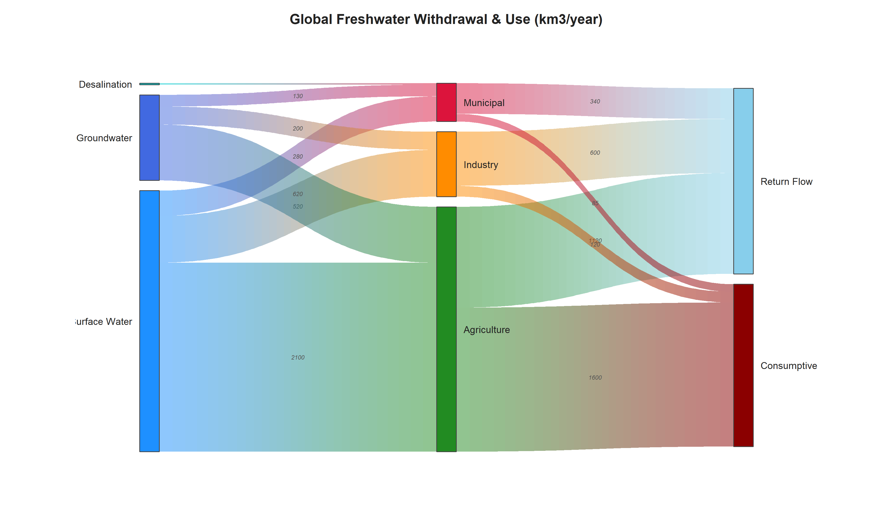
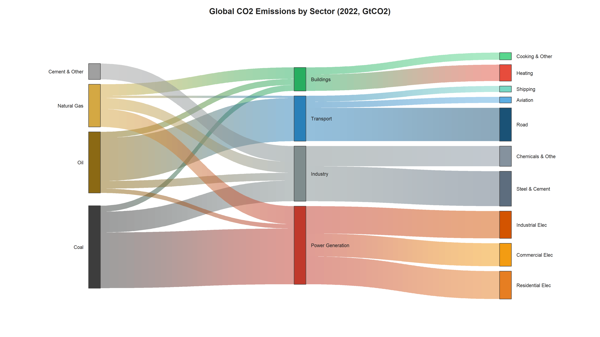
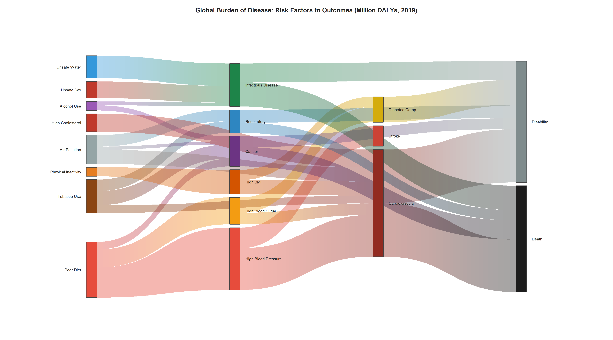
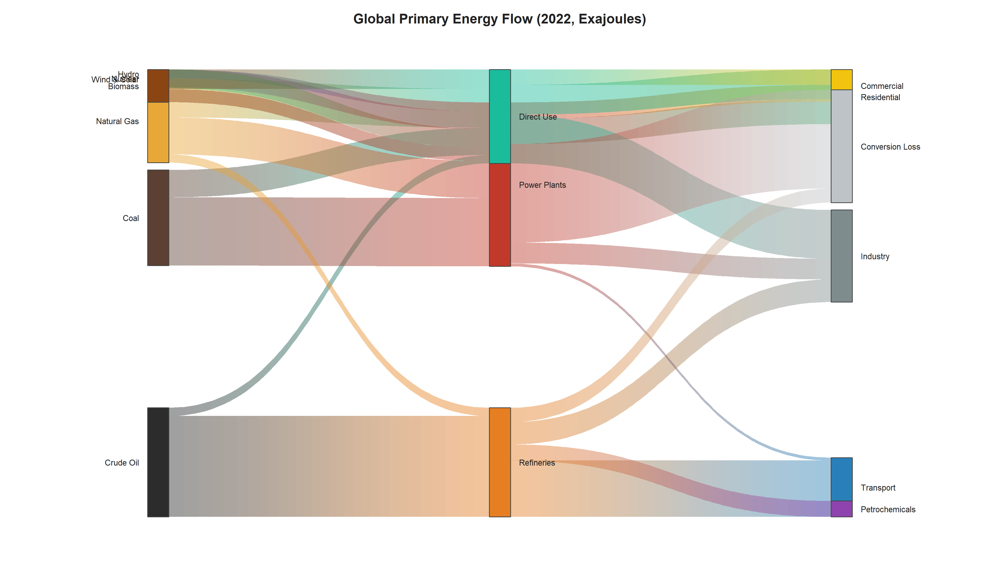

# Sankeyz

**Pure base-R Sankey diagram generator** -- no external packages required.

Create publication-quality, multi-layer Sankey (alluvial) diagrams using only base R graphics. Supports gradient flows, custom color palettes, value labels, column headers, and direct export to PNG, PDF, or SVG.

---

## Features

- **Zero dependencies** -- uses only base R (`graphics`, `grDevices`)
- **Gradient or solid flows** with adjustable transparency
- **10 built-in color palettes**: default, viridis, warm, cool, earth, pastel, bold, neon, ocean, forest
- **Custom node colors** via named hex vector
- **Node value labels** -- `(n=X)` counts and/or `(X%)` percentages
- **Flow value labels** -- display counts on flow bands
- **Column headers** -- label each layer
- **Title, subtitle, and footnote** annotations
- **Node sorting** -- auto (relaxation), descending, ascending, or alphabetical
- **Minimum flow filter** -- hide small flows
- **Font control** -- family, style, and size
- **Multi-format export** -- PNG (300 DPI default), PDF, SVG via `sankey_save()`
- **Easy API** -- `sankey_from_df()` builds a Sankey directly from a dataframe

---

## Files

| File | Description |
|------|-------------|
| `sankey.R` | Core library -- source this to access `sankey()`, `sankey_from_df()`, and `sankey_save()` |
| `demo.R` | Five real-world demo diagrams (CO2 emissions, energy flow, water use, food systems, disease burden) |

---

## Gallery

### Global Freshwater Withdrawal & Use


### Global CO2 Emissions by Sector


### Global Burden of Disease: Risk Factors to Outcomes


### Global Primary Energy Flow


---

## Quick Start

### 1. Source the library

```r
source("sankey.R")
```

### 2. Prepare your links data

Create a data.frame with three columns: `source`, `target`, and `value`.

```r
links <- data.frame(
  source = c("A", "A", "B", "B"),
  target = c("X", "Y", "X", "Y"),
  value  = c(10,  20,  15,   5),
  stringsAsFactors = FALSE
)
```

### 3. Draw to screen

```r
sankey(links)
```

### 4. Save to file

```r
sankey_save(links, file = "my_sankey.png")
```

---

## Detailed Usage

### `sankey()` -- Core drawing function

```r
sankey(
  links,                        # data.frame: source, target, value
  node_colors      = NULL,      # named vector of hex colors (NULL = auto)
  palette          = "default", # built-in palette name or hex color vector
  flow_style       = "gradient",# "gradient" or "solid"
  flow_alpha       = 0.4,       # flow transparency (0 = invisible, 1 = opaque)
  node_width       = 0.03,      # node bar width as fraction of plot width
  node_pad         = 0.03,      # vertical gap between nodes (fraction)
  label_cex        = 0.9,       # label font size multiplier
  label_side       = "auto",    # "auto", "right", "left", or "both"
  label_font       = 1,         # 1=plain, 2=bold, 3=italic, 4=bold-italic
  label_col        = "#222222", # label text color
  show_n           = FALSE,     # show "(n=X)" beside node labels
  show_pct         = FALSE,     # show "(X%)" beside node labels
  flow_labels      = FALSE,     # show value on each flow band
  min_flow         = 0,         # hide flows with value below this threshold
  sort_nodes       = "auto",    # "auto", "value_desc", "value_asc", "alpha"
  col_headers      = NULL,      # character vector of column header labels
  col_header_cex   = 1.0,       # column header font size
  col_header_col   = "#333333", # column header color
  title            = NULL,      # plot title
  title_cex        = 1.3,       # title font size
  subtitle         = NULL,      # subtitle (below title)
  subtitle_cex     = 0.95,      # subtitle font size
  footnote         = NULL,      # footnote (bottom of plot)
  footnote_cex     = 0.7,       # footnote font size
  margin           = c(2, 8, 4, 8), # plot margins c(bottom, left, top, right)
  bg               = "white",   # background color
  border           = "#444444", # node border color
  n_seg            = 50,        # bezier curve segments (higher = smoother)
  gradient_strips  = 30,        # gradient color strips per flow
  relaxation_iters = 30,        # layout relaxation iterations
  font_family      = "sans"     # font family: "sans", "serif", "mono"
)
```

Returns (invisibly) a list with `nodes`, `links`, and `settings` for further inspection.

---

### `sankey_save()` -- Export to file

```r
sankey_save(
  links,              # data.frame: source, target, value
  file,               # output path: .png, .pdf, or .svg
  width  = 16,        # image width in inches
  height = 10,        # image height in inches
  res    = 300,       # PNG resolution (DPI); ignored for PDF/SVG
  ...                 # all other arguments passed to sankey()
)
```

**Examples:**

```r
# High-res PNG
sankey_save(links, file = "output.png", width = 18, height = 11, res = 250,
            flow_style = "gradient", title = "My Diagram")

# PDF (vector graphics, ideal for publication)
sankey_save(links, file = "output.pdf", width = 18, height = 11,
            flow_style = "gradient", title = "My Diagram")

# SVG
sankey_save(links, file = "output.svg", width = 16, height = 10)
```

---

### `sankey_from_df()` -- Easy API for dataframes

Build a multi-layer Sankey directly from a dataframe without manually constructing links. Just specify which columns define the flow layers.

```r
sankey_from_df(
  df,                           # your data.frame
  cols,                         # column names for flow layers (left to right), min 2
  value       = NULL,           # column name to sum as weight (NULL = count rows)
  col_labels  = NULL,           # friendly display names for column headers
  show_n      = FALSE,          # show "(n=X)" beside each node
  show_pct    = FALSE,          # show "(X%)" beside each node
  flow_labels = FALSE,          # show values on flow bands
  palette     = "default",      # color palette name or hex vector
  file        = NULL,           # file path to save (NULL = draw to screen)
  width       = 16,             # image width (inches)
  height      = 10,             # image height (inches)
  res         = 300,            # PNG resolution (DPI)
  ...                           # extra args passed to sankey()
)
```

**Example:**

```r
df <- read.csv("survey_data.csv")

# Draw to screen
sankey_from_df(df, c("Site", "Crop", "Species"), value = "Count")

# Save to PNG with custom labels and palette
sankey_from_df(df, c("Site", "Crop", "Species"), value = "Count",
               col_labels = c("Sampling Site", "Crop Type", "Stinkbug Species"),
               show_n = TRUE, palette = "earth",
               file = "survey_sankey.png")
```

---

## Step-by-Step Walkthrough

### Example: Three-layer Sankey with custom colors

```r
source("sankey.R")

# 1. Read your data
d <- read.csv("my_data.csv", stringsAsFactors = FALSE)

# 2. Aggregate links for Layer 1: Site -> Crop
site_crop <- aggregate(Count ~ Site + Crop, data = d, FUN = sum)
site_crop <- site_crop[site_crop$Count > 0, ]

# 3. Aggregate links for Layer 2: Crop -> Species
crop_species <- aggregate(Count ~ Crop + Species, data = d, FUN = sum)
crop_species <- crop_species[crop_species$Count > 0, ]

# 4. Combine into a single links data.frame
links <- rbind(
  data.frame(source = site_crop$Site,
             target = site_crop$Crop,
             value  = site_crop$Count,
             stringsAsFactors = FALSE),
  data.frame(source = crop_species$Crop,
             target = crop_species$Species,
             value  = crop_species$Count,
             stringsAsFactors = FALSE)
)

# 5. Define custom node colors (optional)
node_colors <- c(
  "SiteA" = "#8B4513",
  "SiteB" = "#D2691E",
  "Corn"  = "#228B22",
  "Wheat" = "#DAA520",
  "Sp1"   = "#E63946",
  "Sp2"   = "#2A9D8F"
)

# 6. Draw to screen
sankey(links,
       node_colors = node_colors,
       flow_style  = "gradient",
       flow_alpha  = 0.45,
       title       = "Site -> Crop -> Species")

# 7. Save to PNG
sankey_save(links,
            file        = "my_sankey.png",
            node_colors = node_colors,
            flow_style  = "gradient",
            flow_alpha  = 0.45,
            title       = "Site -> Crop -> Species",
            width       = 18,
            height      = 11,
            res         = 250)
```

---

## Color Palettes

Use the `palette` parameter to select a built-in color scheme:

| Palette | Description |
|---------|-------------|
| `"default"` | Golden-angle HCL spacing (perceptually uniform) |
| `"viridis"` | Viridis-inspired blue-green-yellow |
| `"warm"` | Reds, oranges, ambers |
| `"cool"` | Teal, sage, earth tones |
| `"earth"` | Browns, greens, goldenrod |
| `"pastel"` | Soft pastels |
| `"bold"` | High-contrast vivid colors |
| `"neon"` | Bright neon hues |
| `"ocean"` | Deep blue to light cyan |
| `"forest"` | Dark to light greens |

You can also pass a vector of hex colors to create a custom ramp:

```r
sankey(links, palette = c("#E63946", "#F1FAEE", "#457B9D"))
```

Or use `node_colors` for full per-node control:

```r
sankey(links, node_colors = c("NodeA" = "#FF0000", "NodeB" = "#0000FF"))
```

When `node_colors` is provided, any nodes not in the named vector are filled using the `palette`.

---

## Node Sorting

| Value | Behavior |
|-------|----------|
| `"auto"` | Relaxation algorithm minimizes crossing (default) |
| `"value_desc"` | Largest nodes at top |
| `"value_asc"` | Smallest nodes at top |
| `"alpha"` | Alphabetical order |

---

## Running the Demos

```r
source("demo.R")
```

This runs five interactive demos with real-world data, each displayed on screen with a "Press Enter" prompt between them. At the end, all five are saved as PNG files in the working directory.

---

## Requirements

- **R >= 3.5** (uses only base packages: `graphics`, `grDevices`, `tools`, `stats`)
- No CRAN packages needed

---

## License

Free to use and modify.
